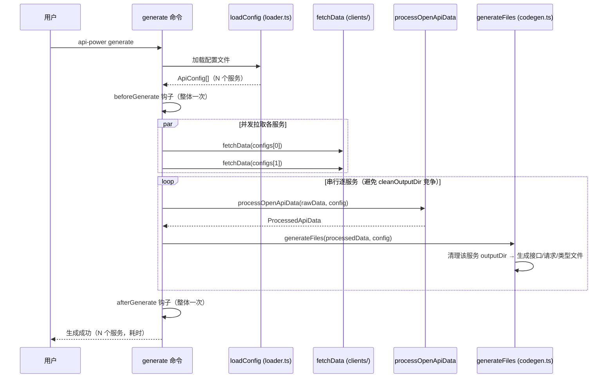
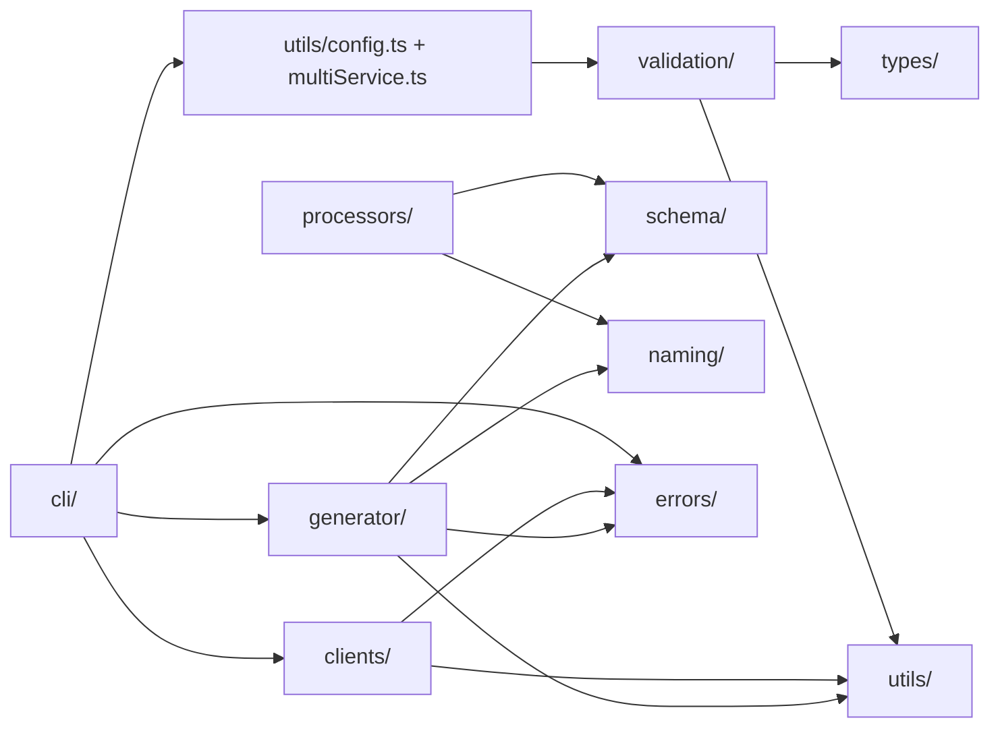

# 高层架构

一句话职责：描述 `api-power` 的分层结构、多服务代码生成的完整数据流，以及模块间依赖关系。

## 分层架构图

```mermaid
graph TD
    subgraph CLI["CLI 层 (src/cli/)"]
        PROG[program.ts<br/>Commander 入口]
        INIT[init]
        GEN[generate]
        DBG[debug]
        VIS[visualize]
    end

    subgraph CONFIG["配置层"]
        DEFINE[utils/config.ts<br/>defineConfig + applyPreset]
        MULTI[utils/multiService.ts<br/>resolveServiceConfigs]
        LOADER[config/loader.ts<br/>加载 + 缓存 ApiConfig&#91;&#93;]
        VALIDATE[validation/<br/>多层校验]
    end

    subgraph CLIENT["客户端层 (src/clients/)"]
        REGISTRY[base/registry.ts<br/>clientRegistry 注册器]
        SWAGGER[implementations/SwaggerClient]
        APIFOX[implementations/ApifoxClient]
    end

    subgraph PROCESSOR["处理层 (src/processors/)"]
        OPENAPI[openapi.ts<br/>OpenAPI 处理器]
        COMMON[common.ts<br/>分组/类型收集]
    end

    subgraph GENERATOR["生成层 (src/generator/)"]
        MAIN[index.ts<br/>generateCode 主入口]
        CODEGEN[codegen.ts<br/>generateFiles 协调器]
        IFGEN[generators/*Generator]
        TMPL[template/<br/>Handlebars 引擎]
    end

    subgraph NAMING["命名 (src/naming/)"]
        STRATEGY[strategy.ts + sanitizer.ts]
    end

    PROG --> INIT & GEN & DBG & VIS
    DEFINE --> MULTI
    MULTI --> VALIDATE
    GEN --> LOADER
    LOADER --> MAIN
    MAIN --> REGISTRY
    REGISTRY --> SWAGGER & APIFOX
    MAIN --> OPENAPI
    OPENAPI --> COMMON
    MAIN --> CODEGEN
    CODEGEN --> IFGEN
    IFGEN --> TMPL
    IFGEN --> STRATEGY
```

## 各层职责

### CLI 层（`src/cli/`）

Commander.js 入口，注册 4 个子命令（generate/init/debug/visualize）。`src/cli/constants.ts` 存放 `init` 使用的默认配置模板。

### 配置层（`src/utils/config.ts` + `src/utils/multiService.ts` + `src/config/` + `src/validation/`）

配置在**配置文件求值时**即完成解析（而非 CLI 运行时）：

1. 用户在 `api-power.config.ts` 中 `export default defineConfig({...})`
2. `defineConfig()` → `resolveServiceConfigs()`（`src/utils/multiService.ts`）：先完整校验（`validateConfiguration`），再对每个 service 以公共配置为基础浅合并，计算 `outputDir = join(baseOutputDir, folder ?? name)`，产出 `ApiConfig[]`
3. CLI 运行时 `loadConfig()`（`src/config/loader.ts`）只负责动态 import 配置文件 + 5 秒 TTL 缓存，并用类型守卫确保导出的是 `ApiConfig[]`；import 时附加唯一查询参数**穿透 ESM 模块缓存**（同一 URL 的动态 import 永远返回首次求值结果，不穿透则配置变更永远不生效）

详见 [配置加载与校验](../03-codebase/config-and-validation.md)。

### 客户端层（`src/clients/`）

插件化注册器架构：`base/registry.ts` 的 `clientRegistry` 按优先级注册客户端（swagger 优先级 10、apifox 优先级 5），`fetchData()` 通过 `autoSelectClient(config)` 自动路由。详见 [客户端层](../03-codebase/clients.md)。

### 处理层（`src/processors/`）

`processOpenApiData(rawData, config)` 将原始 OpenAPI 文档转换为 `ProcessedApiData`：解析路径、提取 Schema、解析 `$ref`、应用 `transformPath`、检测自由格式类型（`src/schema/freeForm.ts`，如 JsonNode → 递归 JsonValue）。详见 [OpenAPI 处理器](../03-codebase/processors.md)。

### 生成层（`src/generator/`）

- `index.ts` 的 `generateCode(configPath)` 是主入口：加载配置 → 并发拉取 → 串行生成
- `codegen.ts` 的 `generateFiles()` 按顺序调度各专用生成器：清理输出目录 → 接口文件 → 请求函数文件 → 类型/Schema 文件
- 模板引擎为 Handlebars（带缓存），位于 `template/`；命名策略独立为顶层 `src/naming/`

详见 [代码生成引擎](../03-codebase/generator.md)。

## 多服务数据流

关键设计：**并发拉取**（`Promise.all`）节省多服务总耗时；**失败隔离**——单个服务获取失败只跳过该服务并逐个报告，其余服务照常生成，最后抛出聚合错误（进程非零退出）；**串行生成**防止各服务清理输出目录时相互覆盖（校验层也会提前拦截 outputDir 相同/嵌套的配置）。

## 模块依赖关系

要点：

- `utils/` 是被依赖最多的基础层（logger、file、escape、path、concurrency 等）
- `schema/` 是中立层（free-form 检测、操作内容提取），processors 与 generator 共同依赖，**方向单向**：processor ← generator 允许，反向禁止（避免循环依赖）
- `naming/` 独立于 generator 之外，processors 与 generator 共同使用
- `types/` 是所有层的中心类型系统（`ApiConfig`、`MultiServiceConfig`、`ApiInterface` 等）
- `errors/` 被所有业务层使用（E1xxx 配置 / E2xxx 网络 / E3xxx 生成）

## Related

- [模块地图](./module-map.md)
- [架构决策记录](./decisions.md)
- [docs/development/architecture.md](../../docs/development/architecture.md)（面向贡献者的英文版架构说明）
