# 客户端层（`src/clients/`）

一句话职责：插件化注册器架构的 API 数据获取层，根据配置自动选择客户端拉取原始 OpenAPI 文档。

## 架构：注册器 + 实现

```mermaid
graph TD
    FETCH[fetchData&#40;config&#41;<br/>clients/index.ts]
    AUTO[clientRegistry.autoSelectClient&#40;config&#41;<br/>base/registry.ts]
    SWAGGER[SwaggerClient<br/>implementations/SwaggerClient.ts<br/>优先级 10]
    APIFOX[ApifoxClient<br/>implementations/ApifoxClient.ts<br/>优先级 5]
    BASE[BaseClient 基类<br/>base/BaseClient.ts]

    FETCH --> AUTO
    AUTO --> SWAGGER
    AUTO --> APIFOX
    SWAGGER -.继承.-> BASE
    APIFOX -.继承.-> BASE
```



| 文件                               | 职责                                                                                       |
| ---------------------------------- | ------------------------------------------------------------------------------------------ |
| `index.ts`                         | 公共 API：`fetchData()` + 注册默认客户端 + 导出 `clientRegistry`                           |
| `base/BaseClient.ts`               | 客户端基类（含重试等公共逻辑，`executeWithRetry`）                                         |
| `base/registry.ts`                 | `clientRegistry`：`register(type, factory, priority)`、`autoSelectClient()`、`getClient()` |
| `implementations/SwaggerClient.ts` | Swagger/OpenAPI 客户端（`createSwaggerClient` 工厂）                                       |
| `implementations/ApifoxClient.ts`  | Apifox 客户端（`createApifoxClient` 工厂）                                                 |

## 核心流程

`fetchData(config)`（`src/clients/index.ts`）：

1. `logger.debug` 记录配置（经 `redactConfig()` 脱敏，`src/utils/redact.ts`，避免 token 泄漏到日志）
2. `clientRegistry.autoSelectClient(config)` 按配置的 `serverType` 选择客户端
3. `client.fetch(config)` 返回 `{ data, sourceType }`
4. 错误统一抛出（由错误系统包装，见 [错误系统与日志](./errors-and-logging.md)）

默认注册（模块加载时执行）：

```typescript
clientRegistry.register('swagger', createSwaggerClient, 10); // 默认兜底
clientRegistry.register('apifox', createApifoxClient, 5);
```

外部可导入 `clientRegistry` 注册自定义客户端（新增数据源无需改动调度代码）。

## 服务类型检测

`parseSourceUrl()`（`src/utils/config.ts`）在配置解析阶段完成：

- URL 主机名包含 `apifox.com` → `ServerType.Apifox`，并从路径正则 `/projects/(\d+)/` 提取 `apifoxProjectId`
- 否则 → `ServerType.Swagger`

## 两个客户端的差异

| 维度     | SwaggerClient              | ApifoxClient                                      |
| -------- | -------------------------- | ------------------------------------------------- |
| 请求方式 | HTTP GET 获取 OpenAPI JSON | HTTP POST（OAS 3.1 导出选项）                     |
| 认证     | 无需 token                 | Bearer Token（`APS-...` 格式）                    |
| 特殊处理 | —                          | 401 → `E2002`、超时 → `E2003`、网络错误 → `E2005` |

旧 API `fetchSwaggerData` / `fetchApifoxData` 仍导出但标记 `@deprecated`，仅为向后兼容。

## Related

- [ADR-003：双客户端架构](../01-overview/decisions.md#adr-003双客户端架构swagger--apifox)
- [术语表 → Source / ServerType](../99-reference/glossary.md#source数据源)
- [错误系统与日志](./errors-and-logging.md)
