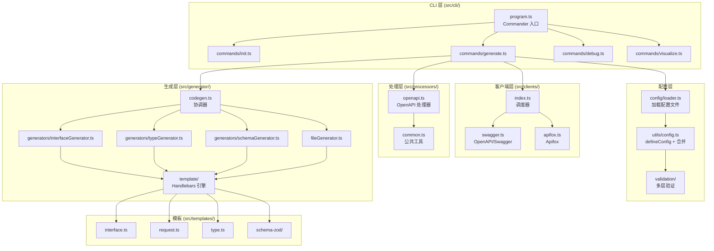
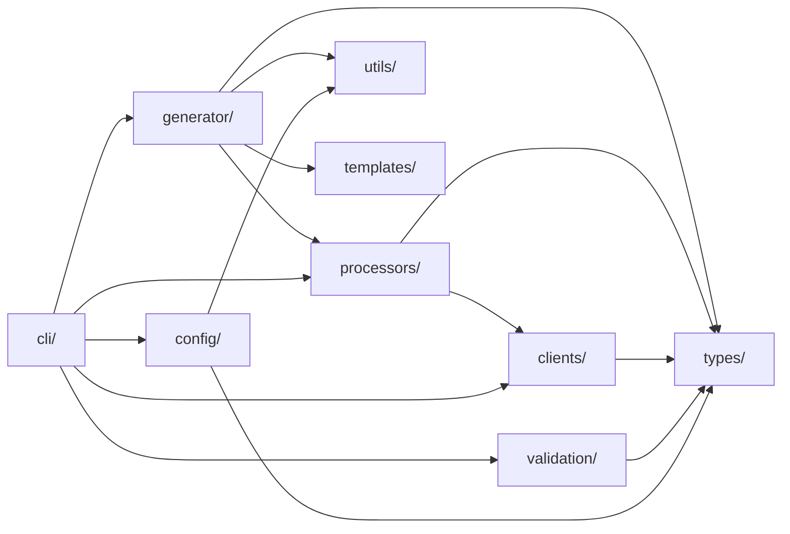
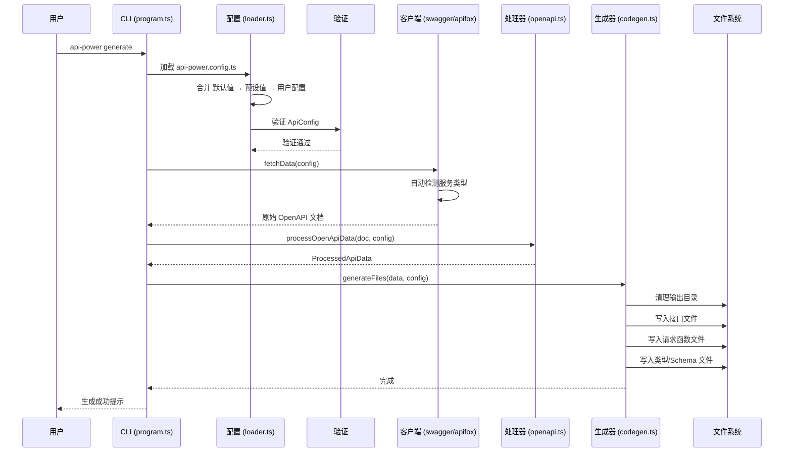

# 高层架构

## 技术栈

| 类别        | 技术                                  | 用途                               |
| ----------- | ------------------------------------- | ---------------------------------- |
| 语言        | TypeScript (strict, ESNext)           | 核心开发语言                       |
| 模块系统    | ESM                                   | package.json 中 `"type": "module"` |
| CLI 框架    | Commander.js                          | 命令定义与解析                     |
| HTTP 客户端 | Axios                                 | 从远程服务器获取 API 定义          |
| 模板引擎    | Handlebars                            | 代码生成模板                       |
| 构建工具    | tsdown (基于 rolldown)                | 生产构建打包                       |
| 代码检查    | ESLint + Prettier (eslint-config-ali) | 代码质量保障                       |
| 版本管理    | standard-version                      | 语义化版本 + 变更日志              |
| Git 钩子    | Husky + lint-staged                   | 提交前质量检查                     |
| 文档站      | VitePress                             | 项目文档网站                       |
| 运行时      | Node.js >= 20.0.0                     | 执行环境                           |

## 系统架构图

## 分层架构

### 第一层：CLI 入口 (`src/cli/`)

工具的入口点，基于 Commander.js 构建，提供 4 个子命令：

- **`generate`** — 核心功能，获取 API 定义并生成代码。支持 `--watch` 模式，配置变更时自动重新生成。
- **`init`** — 使用 `@clack/prompts` 进行交互式配置初始化。
- **`debug`** — 调试工具，用于检查 API 定义。
- **`visualize`** — API 可视化工具。

入口文件：`src/index.ts` → `src/cli/program.ts`

### 第二层：配置 (`src/config/` + `src/utils/config.ts` + `src/validation/`)

三阶段配置系统：

1. **加载** (`config/loader.ts`)：读取 `api-power.config.ts`（或 `.js`/`.mjs`）。
2. **合并** (`utils/config.ts`)：分层应用默认值：`默认值 < 预设值 < 用户配置`。
3. **验证** (`validation/`)：多层验证：
   - `validators/basic.ts` — 必填字段与类型检查
   - `validators/url.ts` — URL 格式与服务类型检测
   - `validators/logic.ts` — 业务逻辑一致性校验

核心类型：`UserConfig`（用户输入）→ `ApiConfig`（完整、已验证的配置）

### 第三层：客户端 (`src/clients/`)

数据获取层，根据 `ServerType` 调度到对应客户端：

- **Swagger** (`swagger.ts`)：直接 HTTP GET 请求 OpenAPI/Swagger JSON 端点。
- **Apifox** (`apifox.ts`)：使用 Token 认证从 Apifox API 获取数据，并进行格式标准化。

服务类型通过 `source` URL 模式自动检测。

### 第四层：处理 (`src/processors/`)

将原始 OpenAPI 文档转换为内部数据结构：

- **`openapi.ts`**：主处理器 —— 解析路径、提取 Schema、解析 `$ref` 引用、标准化响应。
- **`common.ts`**：公共工具 —— 类型收集、按标签分组 API。

输出：`ProcessedApiData`，包含分类后的 `ApiInterface[]` 和 `ApiTypeDefinition[]`。

### 第五层：生成 (`src/generator/`)

采用协调器模式的代码生成引擎：

- **`codegen.ts`**：协调所有生成器。执行顺序：
  1. 清理输出目录（保留 `requestFunctionFilePath`）
  2. 生成接口文件（当 `generateApi` 或 `generateTypes` 为 true 时）
  3. 生成请求函数文件（当 `generateApi` 为 true 时）
  4. 生成类型定义（当 `generateTypes` 为 true 且 `target !== 'javascript'` 时）
     - `typesFormat: 'typescript'` → `typeGenerator.ts`
     - `typesFormat: 'zod'` → `schemaGenerator.ts`

- **模板引擎** (`template/`)：Handlebars，带缓存（`templateCache.ts`）、自定义辅助函数（`templateHelpers.ts`）和分部模板（`templatePartials.ts`）。

### 横切关注点

| 关注点   | 位置                    | 说明                                                                               |
| -------- | ----------------------- | ---------------------------------------------------------------------------------- |
| 类型定义 | `src/types/`            | 所有层的中心类型系统                                                               |
| 命名策略 | `src/generator/naming/` | 通过 `NamingStrategy` 接口实现可插拔命名                                           |
| 文件工具 | `src/utils/file.ts`     | 文件 I/O、目录清理                                                                 |
| 钩子     | `src/types/hooks.ts`    | `CliHooks`：`beforeGenerate`、`afterGenerate`、`beforeWriteFile`、`afterWriteFile` |
| 进度条   | `src/utils/progress.ts` | 基于 `@clack/prompts` 的进度指示器                                                 |
| 日志     | `consola`               | 全局结构化日志                                                                     |

## 模块依赖关系图

## 数据流

