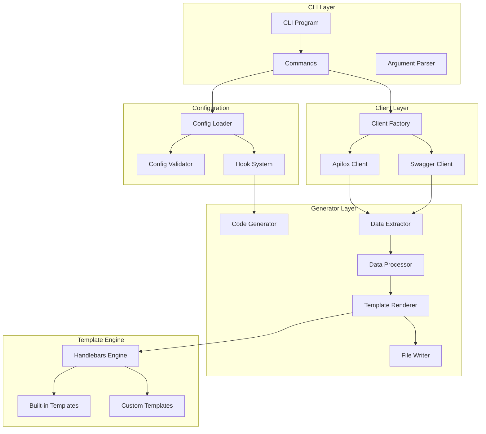
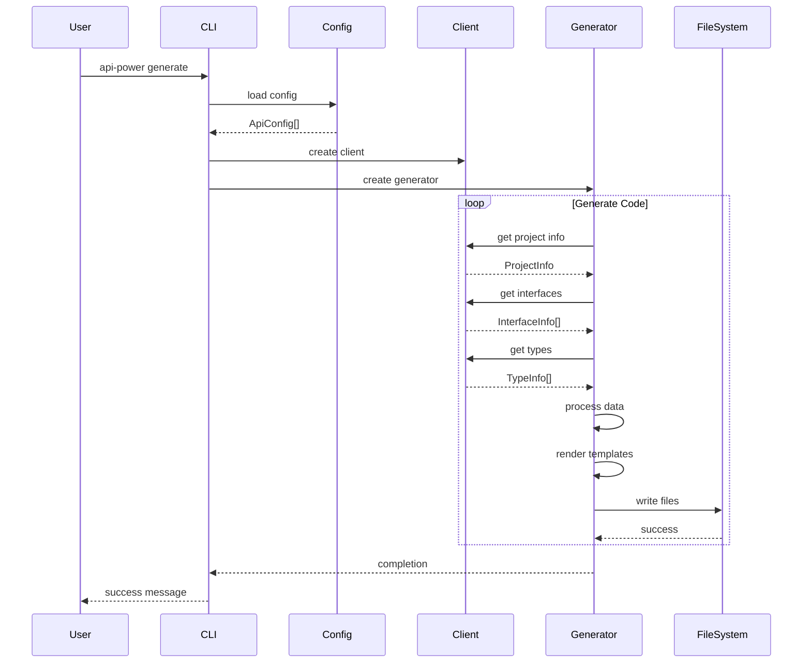
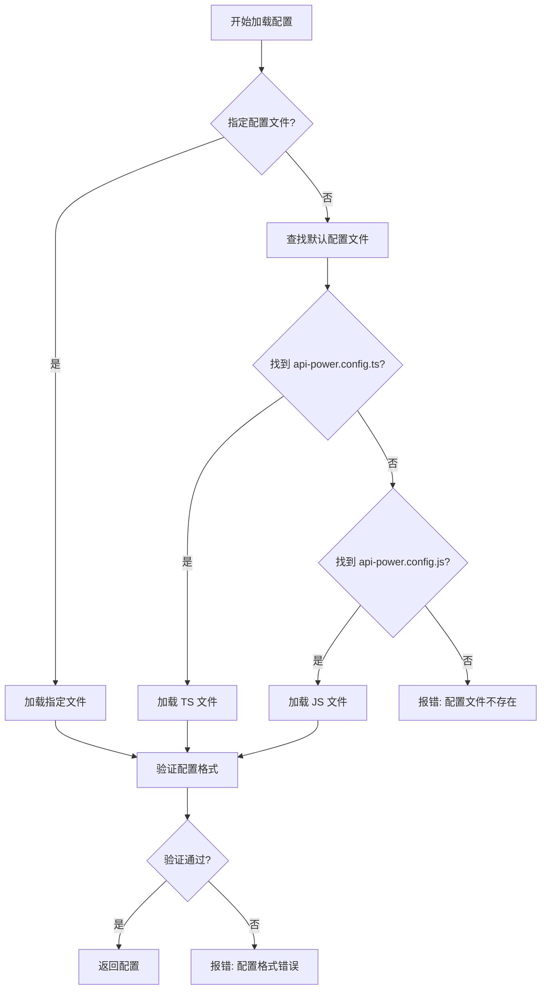

# 架构说明

本文档详细介绍了 `@scx/api-tool` 的系统架构、设计理念和核心组件。

## 总体架构

### 设计理念

`@scx/api-tool` 遵循以下设计原则：

- **模块化**: 每个功能模块独立，便于维护和扩展
- **可扩展性**: 支持多平台、多模板、多输出格式
- **类型安全**: 全面使用 TypeScript，确保类型安全
- **配置驱动**: 通过配置文件控制所有行为
- **插件化**: 支持自定义钩子和插件扩展

### 架构图



## 核心组件

### 1. CLI Layer (CLI 层)

负责命令行接口和用户交互。

#### Program (`src/cli/program.ts`)

主程序入口，设置 CLI 框架和全局配置。

```typescript
import { Command } from 'commander';
import { initCommand } from './commands/init';
import { generateCommand } from './commands/generate';
import { debugCommand } from './commands/debug';

const program = new Command();

program
  .name('api-power')
  .description('Generate TypeScript/JavaScript code from API definitions')
  .version(version);

// 注册命令
program.addCommand(initCommand);
program.addCommand(generateCommand);
program.addCommand(debugCommand);

export default program;
```

#### Commands (`src/cli/commands/`)

各个 CLI 命令的实现：

- **init.ts**: 初始化配置文件命令
- **generate.ts**: 生成代码命令
- **debug.ts**: 调试命令

### 2. Client Layer (客户端层)

负责与不同 API 平台的通信。

#### Client Factory (`src/clients/index.ts`)

客户端工厂，根据配置创建相应的客户端实例：

```typescript
export function createClient(config: ApiConfig): ApiClient {
  switch (config.serverType) {
    case 'apifox':
      return new ApifoxClient(config);
    case 'swagger':
      return new SwaggerClient(config);
    default:
      throw new Error(`Unsupported server type: ${config.serverType}`);
  }
}
```

#### Base Client (`src/clients/base.ts`)

抽象基类，定义客户端接口：

```typescript
abstract class BaseApiClient {
  protected config: ApiConfig;

  constructor(config: ApiConfig) {
    this.config = config;
  }

  abstract getProjectInfo(): Promise<ProjectInfo>;
  abstract getInterfaces(): Promise<InterfaceInfo[]>;
  abstract getTypes(): Promise<TypeInfo[]>;

  protected async request<T>(url: string, options?: RequestOptions): Promise<T> {
    // 通用 HTTP 请求逻辑
  }
}
```

#### Apifox Client (`src/clients/apifox.ts`)

Apifox 平台的客户端实现：

```typescript
export class ApifoxClient extends BaseApiClient {
  private baseUrl = 'https://api.apifox.com/v1';

  async getProjectInfo(): Promise<ProjectInfo> {
    const url = `${this.baseUrl}/projects/${this.config.apifoxProjectId}`;
    return this.request<ProjectInfo>(url);
  }

  async getInterfaces(): Promise<InterfaceInfo[]> {
    const url = `${this.baseUrl}/projects/${this.config.apifoxProjectId}/interfaces`;
    return this.request<InterfaceInfo[]>(url);
  }
}
```

### 3. Generator Layer (生成器层)

负责代码生成的核心逻辑。

#### Generator (`src/generator/index.ts`)

主要的代码生成器，协调各个组件：

```typescript
export class CodeGenerator {
  private config: ApiConfig;
  private client: ApiClient;
  private extractor: DataExtractor;
  private processor: DataProcessor;
  private renderer: TemplateRenderer;

  constructor(config: ApiConfig) {
    this.config = config;
    this.client = createClient(config);
    this.extractor = new DataExtractor(config);
    this.processor = new DataProcessor(config);
    this.renderer = new TemplateRenderer(config);
  }

  async generate(): Promise<string[]> {
    // 1. 获取数据
    const data = await this.extractor.extract();

    // 2. 处理数据
    const processedData = await this.processor.process(data);

    // 3. 渲染模板
    const files = await this.renderer.render(processedData);

    // 4. 写入文件
    return this.writeFiles(files);
  }
}
```

#### Data Extractor (`src/generator/extractor.ts`)

数据提取器，从 API 平台提取原始数据：

```typescript
export class DataExtractor {
  async extract(): Promise<RawData> {
    const [projectInfo, interfaces, types] = await Promise.all([
      this.client.getProjectInfo(),
      this.client.getInterfaces(),
      this.client.getTypes(),
    ]);

    return {
      project: projectInfo,
      interfaces,
      types,
    };
  }
}
```

#### Data Processor (`src/generator/processor.ts`)

数据处理器，将原始数据转换为模板可用的格式：

```typescript
export class DataProcessor {
  process(data: RawData): ProcessedData {
    return {
      config: this.config,
      interfaces: this.processInterfaces(data.interfaces),
      types: this.processTypes(data.types),
      categories: this.groupByCategories(data.interfaces),
    };
  }

  private processInterfaces(interfaces: RawInterface[]): InterfaceInfo[] {
    return interfaces.filter(this.applyFilters.bind(this)).map(this.normalizeInterface.bind(this));
  }
}
```

#### Template Renderer (`src/generator/templateRenderer.ts`)

模板渲染器，使用 Handlebars 渲染代码：

```typescript
export class TemplateRenderer {
  private handlebars: typeof Handlebars;

  constructor(config: ApiConfig) {
    this.handlebars = Handlebars.create();
    this.registerHelpers();
  }

  async render(data: ProcessedData): Promise<GeneratedFile[]> {
    const files: GeneratedFile[] = [];

    // 渲染类型定义
    const typesContent = await this.renderTemplate('types.hbs', data);
    files.push({ path: 'types.ts', content: typesContent });

    // 渲染请求函数
    const requestContent = await this.renderTemplate('request.hbs', data);
    files.push({ path: 'request.ts', content: requestContent });

    return files;
  }

  private async renderTemplate(templateName: string, data: any): Promise<string> {
    const template = await this.loadTemplate(templateName);
    return template(data);
  }
}
```

### 4. Template Engine (模板引擎)

使用 Handlebars 进行模板渲染。

#### Built-in Templates (`src/templates/`)

内置的代码模板：

- **types.ts**: TypeScript 类型定义模板
- **request.ts**: HTTP 请求函数模板
- **interface.ts**: API 接口定义模板
- **config.ts**: 配置文件模板

#### Template Helpers (`src/utils/templateHelpers.ts`)

Handlebars 助手函数：

```typescript
export const registerTemplateHelpers = (Handlebars: typeof Handlebars) => {
  // 类型转换助手
  Handlebars.registerHelper('tsType', (swaggerType: string) => {
    const typeMap = {
      string: 'string',
      integer: 'number',
      boolean: 'boolean',
      array: 'Array<any>',
      object: 'Record<string, any>',
    };
    return typeMap[swaggerType] || 'any';
  });

  // 命名转换助手
  Handlebars.registerHelper('camelCase', (str: string) => {
    return str.replace(/[-_\s]+(.)?/g, (_, c) => (c ? c.toUpperCase() : ''));
  });

  // 条件判断助手
  Handlebars.registerHelper('eq', (a: any, b: any) => {
    return a === b;
  });
};
```

### 5. Configuration (配置系统)

管理配置文件和运行时配置。

#### Config Loader (`src/config/loader.ts`)

配置文件加载器：

```typescript
export class ConfigLoader {
  async load(configPath?: string): Promise<ApiConfig[]> {
    const configFile = this.findConfigFile(configPath);
    const content = await fs.readFile(configFile, 'utf-8');

    if (configFile.endsWith('.ts')) {
      return this.loadTypeScriptConfig(content, configFile);
    } else {
      return this.loadJavaScriptConfig(content, configFile);
    }
  }

  private findConfigFile(configPath?: string): string {
    // 查找配置文件的逻辑
  }
}
```

#### Config Validator (`src/config/validator.ts`)

配置验证器：

```typescript
export class ConfigValidator {
  validate(config: any): ApiConfig[] {
    // 使用 Joi 或类似库进行验证
    const schema = Joi.object({
      serverUrl: Joi.string().uri().required(),
      serverType: Joi.string().valid('apifox', 'swagger').required(),
      outputDir: Joi.string().default('src/service'),
      // ... 其他字段
    });

    const { error, value } = schema.validate(config);
    if (error) {
      throw new Error(`配置验证失败: ${error.message}`);
    }

    return value;
  }
}
```

#### Hook System (`src/utils/hooks.ts`)

钩子系统，支持生命周期钩子：

```typescript
export class HookManager {
  private hooks: Record<string, Function[]> = {};

  register(event: string, hook: Function): void {
    if (!this.hooks[event]) {
      this.hooks[event] = [];
    }
    this.hooks[event].push(hook);
  }

  async execute(event: string, ...args: any[]): Promise<void> {
    const hooks = this.hooks[event] || [];
    for (const hook of hooks) {
      await hook(...args);
    }
  }
}
```

## 数据流

### 生成流程



### 配置加载流程



## 扩展点

### 1. 新平台支持

要支持新的 API 平台，需要：

1. 创建新的客户端类：

```typescript
export class NewPlatformClient extends BaseApiClient {
  async getProjectInfo(): Promise<ProjectInfo> {
    // 实现获取项目信息的逻辑
  }

  async getInterfaces(): Promise<InterfaceInfo[]> {
    // 实现获取接口列表的逻辑
  }
}
```

2. 在客户端工厂中注册：

```typescript
export function createClient(config: ApiConfig): ApiClient {
  switch (config.serverType) {
    case 'apifox':
      return new ApifoxClient(config);
    case 'swagger':
      return new SwaggerClient(config);
    case 'new-platform': // 新增
      return new NewPlatformClient(config);
    default:
      throw new Error(`Unsupported server type: ${config.serverType}`);
  }
}
```

### 2. 自定义模板

用户可以通过配置使用自定义模板：

```typescript
export default defineConfig([
  {
    templateDir: './my-templates',
    templateConfig: {
      typeTemplate: 'my-types.hbs',
      requestTemplate: 'my-request.hbs',
    },
  },
]);
```

### 3. 自定义处理器

可以通过钩子扩展数据处理逻辑：

```typescript
export default defineConfig([
  {
    hooks: {
      afterFetch: async (data) => {
        // 自定义数据处理
        return processedData;
      },
    },
  },
]);
```

## 性能考虑

### 1. 内存管理

- 使用流式处理大型项目
- 及时释放不需要的对象
- 限制并发请求数量

### 2. 缓存策略

- 缓存 API 响应数据
- 缓存编译后的模板
- 使用文件系统缓存

### 3. 并发控制

```typescript
export class ConcurrencyManager {
  private semaphore: Semaphore;

  constructor(maxConcurrent: number) {
    this.semaphore = new Semaphore(maxConcurrent);
  }

  async execute<T>(task: () => Promise<T>): Promise<T> {
    await this.semaphore.acquire();
    try {
      return await task();
    } finally {
      this.semaphore.release();
    }
  }
}
```

## 错误处理

### 错误类型

```typescript
export class ApiToolError extends Error {
  constructor(
    message: string,
    public code: string,
    public details?: any,
  ) {
    super(message);
    this.name = 'ApiToolError';
  }
}

export class ConfigError extends ApiToolError {
  constructor(message: string, details?: any) {
    super(message, 'CONFIG_ERROR', details);
  }
}

export class NetworkError extends ApiToolError {
  constructor(message: string, details?: any) {
    super(message, 'NETWORK_ERROR', details);
  }
}
```

### 错误恢复

- 网络错误自动重试
- 配置错误提供详细提示
- 生成失败时恢复备份

## 安全考虑

### 1. 敏感信息保护

- Token 使用环境变量
- 不在日志中输出敏感信息
- 配置文件加密存储

### 2. 代码执行安全

- 模板渲染沙箱化
- 限制文件系统访问权限
- 验证所有输入数据

### 3. 网络安全

- 使用 HTTPS 连接
- 验证 SSL 证书
- 设置请求超时

## 监控和日志

### 日志系统

```typescript
export class Logger {
  private level: LogLevel;

  constructor(level: LogLevel = LogLevel.INFO) {
    this.level = level;
  }

  debug(message: string, ...args: any[]): void {
    if (this.level <= LogLevel.DEBUG) {
      console.debug(`[DEBUG] ${message}`, ...args);
    }
  }

  info(message: string, ...args: any[]): void {
    if (this.level <= LogLevel.INFO) {
      console.info(`[INFO] ${message}`, ...args);
    }
  }

  error(message: string, error?: Error): void {
    console.error(`[ERROR] ${message}`);
    if (error) {
      console.error(error.stack);
    }
  }
}
```

### 性能监控

- 记录生成时间
- 监控内存使用
- 统计接口数量

## 测试架构

### 测试分层

1. **单元测试**: 测试单个函数和类
2. **集成测试**: 测试组件间交互
3. **端到端测试**: 测试完整流程
4. **性能测试**: 测试大规模数据处理

### 测试工具

- **Jest**: 测试框架
- **nock**: HTTP 模拟
- **fs-extra**: 文件系统测试
- **typescript**: 类型检查测试

## 未来规划

### 短期目标

- 支持更多 API 平台
- 优化大项目性能
- 增强错误处理

### 长期目标

- 插件系统
- 可视化配置界面
- 云端 API 管理

---

这个架构设计确保了系统的可维护性、可扩展性和性能，为未来的功能扩展奠定了坚实的基础。
